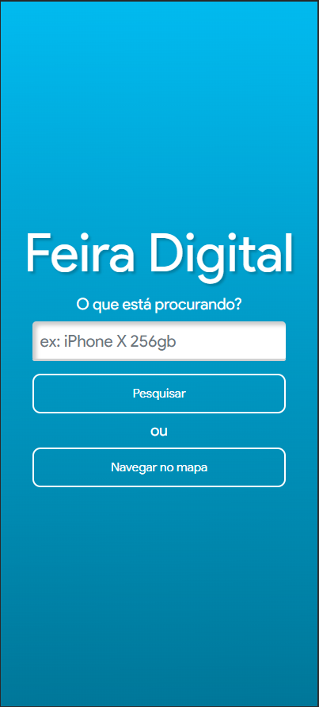
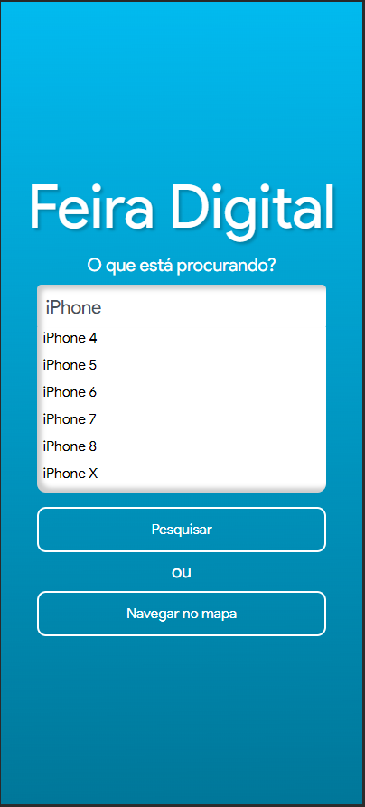
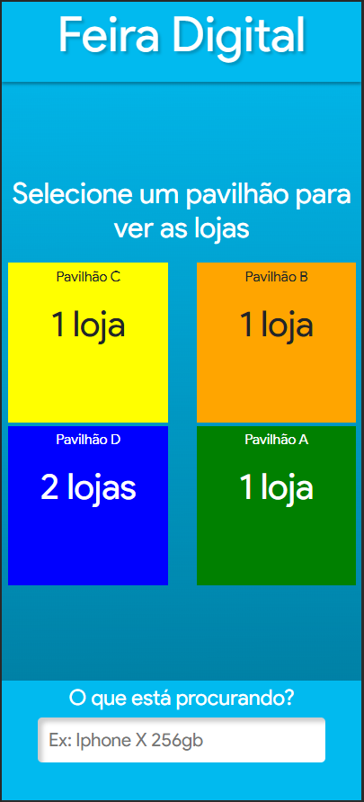
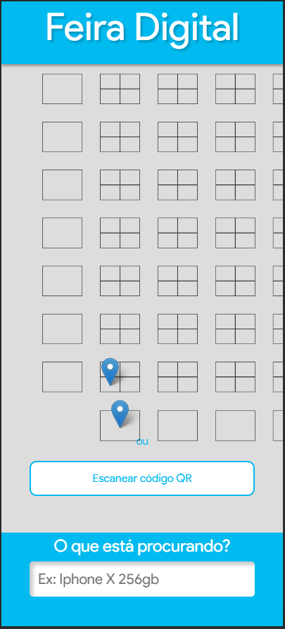

## Feira Digital é um aplicativo que tem como objetivo auxiliar a navegação na Feira dos importados de Brasília.

Com o Feira Digital, seria possível pesquisar bancas de uma feira que vendem um produto do seu interesse e saber exatamente como chegar nessa banca, assim como o Google Maps.

Utilizei o framework Vue.js para desenvolver o frontend, socket.io para fazer algumas funções, como o TypeAhead e o Axios para realizar requisições web.

Screenshots do projeto:

